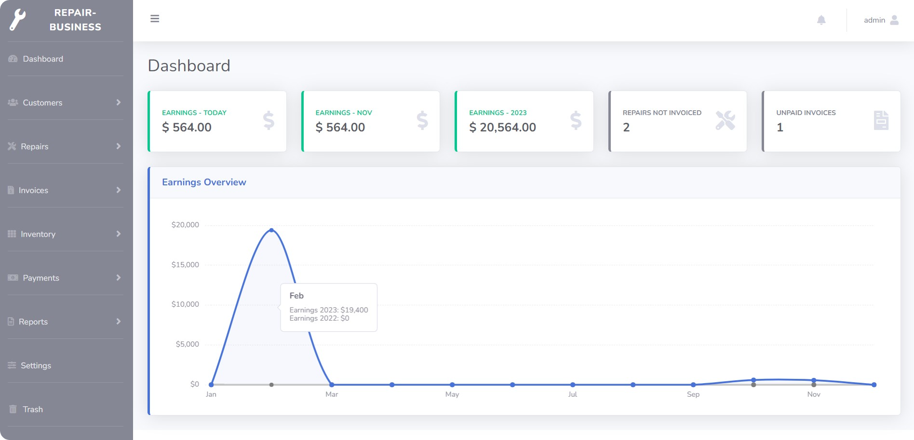

# REPAIR BUSINESS
*Seamlessly handle repairs, invoices, payments, and generate reports in a `fast-paced repair business environment`.*

### Highlights
- Laravel 7
- PHP7 - PHP8
- MYSQL
- Docker Compose
- Daily Database Backup Scheduling `php artisan database:plan`
- Boostrap 4 
- Thermal Printer Drop-off Receipt and Invoice
- E-mail Invoice/Drop-off Repair Receipt

### Docker
Perform operations easily with Docker. Preconfigured Docker Compose eases setup with one-time commands for migrations and database seed.

