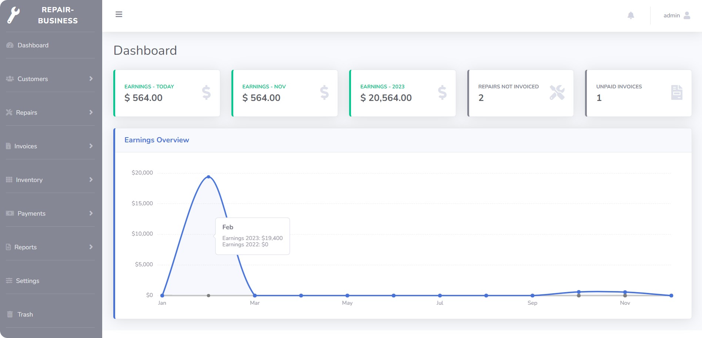

# REPAIR BUSINESS
*Seamlessly handle repairs, invoices, payments, and generate reports in a `fast-paced repair business environment`.*

### Highlights
- Laravel 8
- PHP 8
- mySQL
- Docker
- Boostrap 4 
- Thermal Printer Drop-off Receipt and Invoice
- E-mail Invoice/Drop-off Repair Receipt

