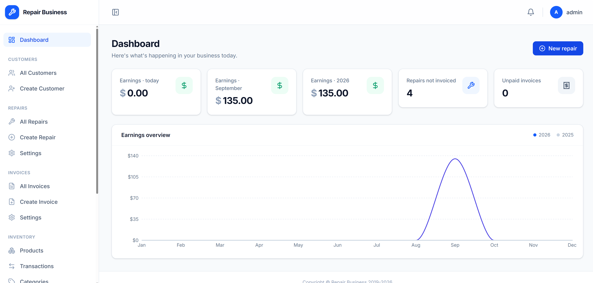

# REPAIR BUSINESS

*Seamlessly handle repairs, invoices, payments, and generate reports in a `fast-paced repair business environment`.*

## Highlights
- Laravel 8 JSON API + PHP 8.1
- React 18 SPA (Vite 5 + Tailwind CSS 4)
- MySQL 8.4
- Single multi-stage Docker image — Apache serves the React SPA and the `/api/*` backend on port 80
- Docker Compose (ports mapped via `.env`) · Google Cloud-ready
- Barcode scanning for fast POS checkout (invoice / drop-off repair)
- Invoice & drop-off receipt as printable PDF (thermal-printer friendly) + email delivery
- i18n (English / Español), roles (user / admin), soft-delete trash, notifications, reports

## Tech Stack
| Layer | Tech |
|---|---|
| Frontend | React 18, Vite 5, React Router 6, Tailwind CSS 4, axios, recharts, lucide-react |
| Backend | Laravel 8, Sanctum bearer-auth API, Laravel DomPDF, barcode generation |
| Database | MySQL 8.4 |
| Serving | `php:8.1-apache` — SPA for UI routes, Laravel for `/api/*` (one container, port 80) |
| Tooling | Docker / Docker Compose, phpMyAdmin (dev) |

## Architecture
One multi-stage Docker image does everything:
1. Composer installs the Laravel backend.
2. Node builds the React SPA (`client/` → Vite `dist`).
3. `php:8.1-apache` serves the app on port 80 — `public/.htaccess` routes non-`/api` requests to the SPA and `/api/*` to Laravel.

Compose maps that port through `.env` (`SERVICE_PORT` → 80) plus a dev-only Vite server (`CLIENT_PORT` → 5173) that proxies `/api` to the app. phpMyAdmin runs alongside on `:9010` for convenience.

## Quick Start (Production-style single container)
```
cp .env.example .env           # set APP_KEY, DB credentials, SERVICE_PORT, CLIENT_PORT
docker compose up -d           # builds image, starts app + optional dev client
docker exec -w /var/www repair-business-app php artisan migrate --seed
```
Open `http://localhost:${SERVICE_PORT}`. The same image deploys to Google Cloud unchanged (serves TCP 80; set `APP_URL`/env via the Laravel `.env` at deploy time).

## Development
PHP changes stream in via the bind mount (`.:/var/www`). React developers use the Vite server on `:5173` for hot-reload and `/api` proxying; keep Artisan builds out of the loop for UI work.

Rebuild Flow (when `public/`, SPA, or Composer deps change):
```
docker compose build && docker compose up -d --force-recreate app
```
Because `public/`, `vendor/`, `storage/`, and `bootstrap/cache` are anonymous image volumes, reseed them from a fresh image with `docker compose down -v && docker compose up -d` (does not touch the database or phpMyAdmin).

Commands:
```
docker exec -w /var/www repair-business-app php artisan migrate --seed
docker exec -w /var/www repair-business-app ./vendor/bin/phpunit
docker exec mysql_development mysqldump -u <user> -p <db> > backup.sql
```

See `AGENTS.md` for the full workflow (everything runs inside Docker; never install tooling on the host).

## Screenshot
